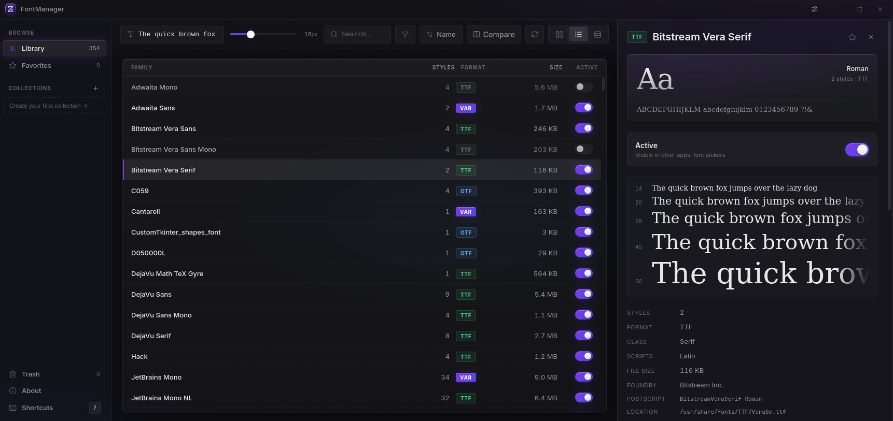
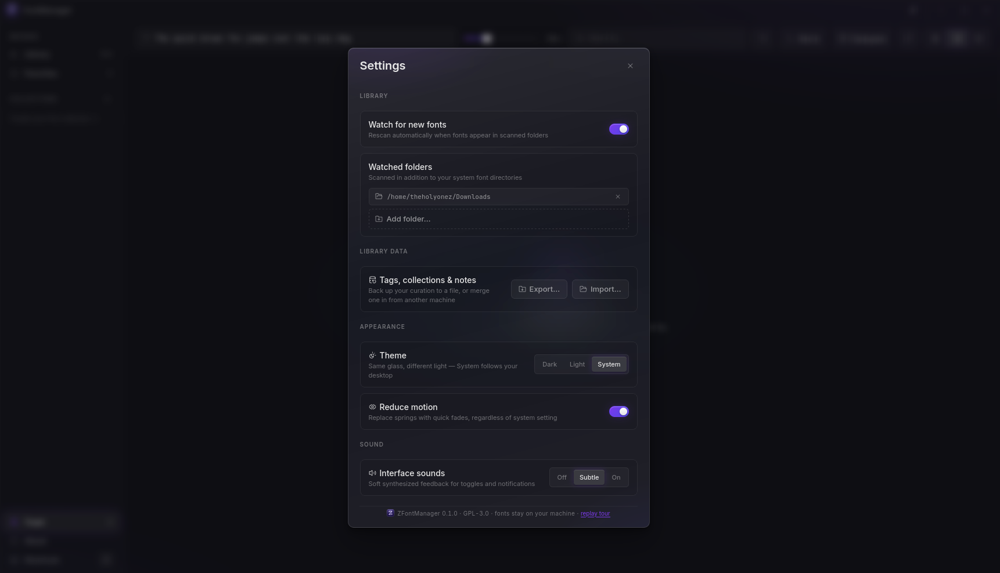

<div align="center">


# ZFontManager

**The font manager Linux never got — and Windows &amp; macOS make you pay for.**

Preview, organize, activate and install fonts across all three desktop platforms,<br>
from one clean, fast, native app. Your fonts never leave your machine.

<br>

[](LICENSE)
[](https://zsync.eu/zfontmanager/)
[](#-platform-notes)
[](#-translations)
[](https://tauri.app)

<br>

**[⬇ Download](https://zsync.eu/zfontmanager/)** ·
**[🌐 Website](https://zsync.eu)** ·
**[💻 Source Code](https://github.com/TheHolyOneZ/ZFontManager)** ·
**[👤 The Developer](https://github.com/TheHolyOneZ)**

<br>
<br>



<sub>The library: every family rendered live, one toggle away from any app's font menu.</sub>

</div>

<br>

---

## 📖 Table of contents

- [Why ZFontManager?](#-why-zfontmanager)
- [Feature tour](#-feature-tour)
  - [Your whole library, rendered live](#your-whole-library-rendered-live)
  - [Activate &amp; deactivate — the killer feature](#activate--deactivate--the-killer-feature)
  - [Try a font before committing](#try-a-font-before-committing)
  - [Apply a font in Photoshop or Illustrator](#apply-a-font-in-photoshop-or-illustrator)
  - [Auto-activate for Affinity by Canva](#auto-activate-for-affinity-by-canva)
  - [Browse and download free fonts](#browse-and-download-free-fonts)
  - [Installing fonts](#installing-fonts)
  - [Activate a whole library at once](#activate-a-whole-library-at-once)
  - [When two fonts share a name](#when-two-fonts-share-a-name)
  - [A trash can, not a shredder](#a-trash-can-not-a-shredder)
  - [Organize: tags, collections, favorites, notes](#organize-tags-collections-favorites-notes)
  - [Find anything](#find-anything)
  - [Compare fonts side by side](#compare-fonts-side-by-side)
  - [The waterfall view](#the-waterfall-view)
  - [Peek inside a font](#peek-inside-a-font)
  - [Export a specimen sheet](#export-a-specimen-sheet)
  - [The command palette](#the-command-palette)
  - [Themes, sound &amp; motion](#themes-sound--motion)
  - [Your language](#your-language)
  - [Back up your curation](#back-up-your-curation)
- [Keyboard shortcuts](#-keyboard-shortcuts)
- [Translations](#-translations)
- [Getting ZFontManager](#-getting-zfontmanager)
- [Platform notes](#-platform-notes)
- [Privacy](#-privacy)
- [FAQ](#-faq)
- [Building from source](#-building-from-source)
- [About the developer](#-about-the-developer)
- [Contributing](#-contributing)
- [License](#-license)

---

## 💡 Why ZFontManager?

If you've ever worked with type on Linux, you know the drill: fonts live in
scattered folders, previewing means opening each file one by one, and
"managing" them means a terminal and crossed fingers. On Windows and macOS
the situation is better — but the good tools cost real money.

ZFontManager is the answer to both:

- **One app, three platforms.** The same clean interface on Linux, Windows and macOS.
- **Native and fast.** Not a website in a box — it starts quickly, scrolls
  smoothly through hundreds of families, and feels at home on your desktop.
- **Speaks your language.** Nine languages, picked up from your system
  automatically — English, Deutsch, Español, Français, Português (Brasil),
  Русский, 日本語, 简体中文 and 繁體中文.
- **Yours.** Free, open source (GPL-3.0), no account, no cloud, no telemetry.
  Everything happens on your machine.

> [!NOTE]
> ZFontManager is currently at **version 0.3.0** — see the
> [changelog](CHANGELOG.md) for what's new. It's already very usable
> day-to-day, but expect the occasional rough edge — and please
> [report anything odd](https://github.com/TheHolyOneZ/ZFontManager/issues)!

---

## ✨ Feature tour

### Your whole library, rendered live

On first launch, ZFontManager scans the standard font locations on your
system — both the system-wide ones and your personal user fonts — and builds
your library automatically. You can add extra folders to watch in Settings,
and the app notices when new fonts appear in them.

Every font family is shown **in its own typeface**, not as a generic name in
a list. Type any sentence into the preview box at the top — your brand name,
a headline you're working on — and the *entire library* re-renders in it
instantly. A size slider takes the preview anywhere from small print to
poster size.

Fonts with many weights and italics are grouped into a single family card.
Expand the card and every style — Light, Regular, Bold, Black, the italics —
renders live underneath.

Three views, switchable from the top bar:

| View | What it's for |
|---|---|
| **Grid** | Big, comfortable cards — the browsing view |
| **List** | Compact rows with style count, format and size — the overview |
| **Waterfall** | One family shown at every size at once — the type-nerd view |

### Activate &amp; deactivate — the killer feature

This is what separates a font *manager* from a font *viewer*.

A huge font library is wonderful — until you open the font picker in your
design app and have to scroll past 900 entries. **Deactivating** a font in
ZFontManager removes it from other applications' font menus *without
uninstalling it*. The files stay exactly where they are; the font just goes
to sleep. Flip the toggle again and it's back.

- Toggle a single family with one click (or press <kbd>Space</kbd>)
- Select many families and activate/deactivate them all at once
- Deactivated fonts stay in your library, gently dimmed, ready to wake up

Each platform has its own proper mechanism under the hood (see
[Platform notes](#-platform-notes)) — but from where you sit, it's just a
switch.

> [!TIP]
> Keep your everyday fonts active and park the other 800 decorative ones.
> Your design app's font menu becomes usable again, and every font is still
> one click away.

### Try a font before committing

Not sure you want that font cluttering your menus permanently? Right-click →
**"Activate until close"** wakes a font up *for this session only*. When you
quit ZFontManager, it's automatically put back to sleep. Perfect for
auditioning a typeface in your design app without any cleanup afterwards.

### Apply a font in Photoshop or Illustrator

On Windows and macOS, right-click a family → **"Apply in Photoshop…"** or
**"Apply in Illustrator…"** (also in the command palette for the selected
family). ZFontManager hands the font to the running app: every selected text
layer or text frame switches to it, and if nothing is selected, a new text
layer is added with the family name as its sample. A sleeping font is woken
"until close" first, so auditioning never installs anything permanently.

> [!NOTE]
> This integration is new in 0.3.0 and could not be tested against a real
> Photoshop or Illustrator before release. It fails safely (every problem
> shows up as a toast, nothing is changed in your document), but if it
> misbehaves for you, please
> [open an issue](https://github.com/TheHolyOneZ/ZFontManager/issues) with the
> app version and what the toast said.

### Auto-activate for Affinity by Canva

Open a document in Affinity and ZFontManager can switch on the fonts it asks
for, automatically, for as long as Affinity is running — then switch them back
off when you quit. Nothing is installed permanently.

Turn it on under **Settings → Affinity by Canva auto activation**. It needs
**Affinity 3.2 or newer** with *Settings → Model Context Protocol* enabled
(restart Affinity afterwards).

> [!NOTE]
> Affinity by Canva ships for Windows and macOS only, so this section is
> hidden on Linux and the watcher never runs there.

### Browse and download free fonts

Nearly two thousand open-licence families — everything on Google Fonts — from
inside the app. Switch it on under **Settings → Online font browser**, and an
**Online** section appears in the sidebar. Search by name, filter by category or
licence, show variable fonts only, and add a family to your library with one
click. Downloaded families are tagged *Online* so they're easy to find.

Open a family and you see your sample text rendered live in it, alongside the
licence — its name, a link to the full text, and the Reserved Font Name where
the OFL declares one. The preview fetches one face through the same gated
client; adding the family reuses that file rather than downloading it twice.
The licence text is stored alongside the font.

This is the first feature that talks to the internet, so it's built carefully:

- **Off by default.** A fresh install never contacts a font provider.
- **Switching it on sends nothing.** A request goes out only when you open the
  Online section and search or download — never in the background.
- **Search is local.** The catalogue is fetched once and cached for seven days;
  typing filters it on your machine. The provider sees one request per week,
  not one per keystroke.
- **Two named hosts, both listed under the toggle:** `api.fontsource.org` for
  the catalogue and `raw.githubusercontent.com` for the files.
- **Nothing about your library leaves the machine.** The "in library" badge is
  computed locally.

Files come straight from the [google/fonts](https://github.com/google/fonts)
repository — the canonical source everything else mirrors — so you get the
complete font, not a web-optimised subset. That's why Bunny Fonts and Fontsource's
own CDN aren't used for downloads: both serve only script-subsetted web files,
which would install a dozen partial copies of each style. Fontshare isn't
offered because its licence forbids redistribution.

### Installing fonts

Drag anything into the window:

- individual font files (TTF, OTF, TTC, WOFF and friends),
- whole folders,
- even **ZIP archives** — fresh from a font site, no unzipping needed.

Then pick how the file should be handled:

- **Add to library** — the font stays exactly where it is and is registered
  from there. Good for fonts on an external drive or in a project folder.
- **Copy to system folder** — the font is copied into your library folder and
  the original is removed.

You can point the library folder somewhere else entirely under
**Settings → Library folder**. A progress toast keeps you informed on big
drops, and anything already in your library is skipped rather than duplicated.

### Activate a whole library at once

<kbd>Ctrl</kbd> <kbd>A</kbd> (<kbd>⌘</kbd> <kbd>A</kbd> on macOS) selects every
font currently in view — the whole library, or just what your filters and
search have narrowed it to. Right-click the selection and activate or
deactivate the lot in one go, with a single undo if you change your mind.
It's also in the command palette as *Select all*.

### When two fonts share a name

Install a font that clashes with one already in your library and ZFontManager
says so instead of quietly picking a winner. The detail panel lists every file
involved, tells you which copy is the active one, and lets you act on each
file separately — keep it, remove it, or send it to the Trash. System fonts
are marked as protected and can't be removed either way.

### A trash can, not a shredder

Uninstalling a font never silently deletes anything. Removed fonts go to a
**restorable Trash** inside the app — the actual files are kept safe. Made a
mistake? Open the Trash tab, hit Restore, and the font is back exactly where
it was. Only "Empty Trash" or a per-item "Delete permanently" actually
removes files, and both are clearly marked.

### Organize: tags, collections, favorites, notes

Four complementary ways to impose order on font chaos:

- **Tags** — free-form labels on any family ("condensed", "80s", "client-x").
  Tags appear in the sidebar and act as instant filters. Tag many fonts at
  once via multi-select.
- **Collections** — folders you curate by hand, per project or per client.
  Right-click any font → Collections → add it. A font can live in as many
  collections as you like.
- **Favorites** — one star for your go-to typefaces, with its own sidebar view.
  Press <kbd>F</kbd> on any selected font.
- **Notes** — a small text field per family for things you'd otherwise
  forget: *"licensed for Client X only"*, *"kerning breaks above 60px"*.

### Find anything

- **Search** by name, live as you type (press <kbd>/</kbd> to jump to the box).
- **Show** all fonts, only the ones your system shipped, or only the ones you
  installed yourself. Handy when your own fonts are buried among hundreds of
  system faces.
- **Filter** by classification — Serif, Sans, Mono, Script, Display and more.
- **Filter** by writing system — Latin, Cyrillic, Greek, and others.
- **Filter** by file format — OpenType, TrueType, WOFF and WOFF2.
- **Filter** by typographic feature — swashes, stylistic alternates,
  discretionary ligatures, small caps, oldstyle figures and fractions. If you
  are looking for faces with alternate letterforms, start here.
- **Filter** by character — type any character and the library narrows to the
  fonts that actually have a glyph for it. This one reads every font file, so
  it runs when you ask rather than continuously.
- **Variable fonts only** — one switch to see just the flexible ones.
- **Hide fonts the OS won't let you turn off** — on Windows and macOS, drop the
  system fonts and see only what you can actually act on.
- **Sort** by name, style count, file size, or glyph count.

The sidebar also narrows the library by state: **Activated**, **Activated
until close**, **Deactivated**, **Last imported** and **System fonts**. Each
one is reachable from the command palette too, so you can jump straight there
without reaching for the mouse. Its Browse, Collections and Tags sections each
fold away if you would rather not see them, and stay folded next time.

Filters combine, and the empty state always tells you which filters are
active so you're never staring at a mysteriously empty library.

### Compare fonts side by side

Select two to four families — <kbd>Ctrl</kbd>+Click each one, or hold
<kbd>Shift</kbd> and use the arrow keys — and a small bar appears at the
bottom of the window with a **Compare** button. Click it (or just press
<kbd>C</kbd>, or right-click the selection) and the compare view opens: the
same preview text rendered in parallel, resizable, so you can finally settle
"which of these three sans-serifs is *the one*" with your own eyes instead
of your memory.

### The waterfall view

One family, every size from small to huge, stacked on one screen. This is
how type designers evaluate a font — you can instantly see where it gets
muddy, where the details shine, and whether it holds up at footnote size.

### Peek inside a font

Click any family and the detail panel slides in:

- **Every style** listed with live samples and per-style export
- **Variable font axes** — drag sliders for weight, width, slant and
  whatever else the font offers, and watch the preview morph in real time
- **OpenType features** — ligatures, small caps, stylistic alternates,
  oldstyle numerals… toggle them and see exactly what they do before you
  enable them in your design app
- **Character map** — every glyph the font actually contains; click a
  character to copy it
- **The practical facts** — format, glyph count, file size, file path, license
  info when the font declares one, plus your tags and notes

### Export a specimen sheet

Right-click a family → **Export specimen** and get a beautiful, shareable
PNG type specimen — the classic "alphabet + sizes + sample text" sheet.
Perfect for sending to a client ("option A or option B?") without them
needing the font installed.

You can also export the font files themselves (single style or whole
family), or export your entire font list as metadata for spreadsheet people.

### The command palette

Press <kbd>Ctrl</kbd><kbd>K</kbd> and type. Jump to any view, open any
collection, switch themes, rescan, find a specific font by name — everything
in the app is a few keystrokes away. If you use it in your editor or
browser, it works exactly the way you expect.

### Themes, sound &amp; motion

- **Dark and light themes**, plus a System option that follows your desktop.
  Same glass aesthetic, different light.
- **Interface sounds** — soft, synthesized feedback for toggles and events.
  Three levels: on, subtle, or off.
- **Reduced motion** — replaces the springy animations with quick fades,
  independently of (or together with) your system-wide preference.
- **Reduced transparency** — swaps the frosted glass for solid panels. Easier
  to read, and it removes the most expensive thing the app draws, which is
  worth a lot on older integrated graphics.
- **Interface scale** — ZFontManager measures the usable area of your screen at
  startup and picks a scale that fits the whole interface into it, so a small
  or low-resolution display shows the entire layout rather than a cropped one.
  Leave it on Auto or pin it between 80% and 125% yourself; larger settings are
  just as useful on a big display.
- A **first-launch tour** glides a spotlight over the interface and teaches
  the essentials in a minute. Replayable anytime from Settings.

<div align="center">



<sub>Settings: watched folders, one-file backup, themes, motion and sound to taste.</sub>

</div>

### Your language

ZFontManager follows your desktop language on first launch, and you can
override it any time in **Settings → Language** (or from the command palette).

Available now: **English**, **Deutsch**, **Español**, **Français**,
**Português (Brasil)**, **Русский**, **日本語**, **简体中文**, **繁體中文**.

More are welcome — see [Translations](#-translations).

### Back up your curation

Your tags, collections, favorites and notes are the real work — the fonts
themselves you can always re-download. Settings → **Export library data**
saves all of it to a single file; **Import** merges it back in, on this
machine or another one.

---

## 🎹 Keyboard shortcuts

The whole app is keyboard-navigable — every card, button and menu. Press
<kbd>?</kbd> inside the app (or click **Shortcuts** in the sidebar) for this
same list in a pretty overlay.

<details open>
<summary><b>Navigate</b></summary>
<br>

| Keys | Action |
|---|---|
| <kbd>Ctrl</kbd> <kbd>K</kbd> | Open the command palette |
| <kbd>/</kbd> | Jump to search |
| <kbd>↑</kbd> <kbd>↓</kbd> <kbd>←</kbd> <kbd>→</kbd> | Move through the library |
| <kbd>Home</kbd> / <kbd>End</kbd> | First / last font |
| <kbd>Tab</kbd> | Walk every control, font cards included |
| <kbd>Esc</kbd> | Close panels, deselect |

</details>

<details open>
<summary><b>Select</b></summary>
<br>

| Keys | Action |
|---|---|
| <kbd>Enter</kbd> | Select the focused card |
| <kbd>Shift</kbd> <kbd>↑</kbd>/<kbd>↓</kbd> | Extend the selection |
| <kbd>Ctrl</kbd> + Click | Add a font to the selection |
| <kbd>Shift</kbd> + Click | Select a range |
| <kbd>Ctrl</kbd> <kbd>A</kbd> | Select every font in view |

</details>

<details open>
<summary><b>Act on the selection</b></summary>
<br>

| Keys | Action |
|---|---|
| <kbd>Space</kbd> | Activate / deactivate |
| <kbd>C</kbd> | Compare the selected fonts (2–4) |
| <kbd>F</kbd> | Favorite / unfavorite |
| <kbd>Del</kbd> | Move to Trash (always restorable) |
| <kbd>Shift</kbd> <kbd>F10</kbd> or <kbd>≡ Menu</kbd> | Open the context menu — arrows browse it |
| <kbd>?</kbd> | Show the shortcuts overlay |

</details>

---

## 🌍 Translations

Every piece of interface text lives in one JSON file per language under
[`src/locales/`](src/locales). Adding a language, or fixing a single phrase that
reads awkwardly, is a small pull request — no Rust, no TypeScript, no build
tooling required.

- **[docs/TRANSLATING.md](docs/TRANSLATING.md)** — how to add a language or fix wording
- `pnpm i18n:check` — reports coverage, unknown keys and placeholder mistakes

Two ways to help, both fine:

- **Send a pull request** with a new or corrected language file.
- **Just ask.** Open an issue naming the language you want and it gets added —
  no git required. Reviewing a draft as a native speaker counts too, and is
  often the part that's actually missing.

Partial translations are welcome: anything not yet translated falls back to
English, so a half-finished language file still ships something useful. Plural
rules are handled per language — the checker tells you which forms yours needs.

---

## 📦 Getting ZFontManager

The easiest way is the official download page, which always has the latest
build for your platform:

<div align="center">

### **[zsync.eu/zfontmanager](https://zsync.eu/zfontmanager/)**

</div>

Prefer to build it yourself? See
[Building from source](#-building-from-source) below — it's three commands.

---

## 🧭 Platform notes

ZFontManager speaks each operating system's native font language — no hacks,
no "portable font folder" tricks.

<table>
<tr><th align="left">Platform</th><th align="left">How activation works, in plain words</th></tr>
<tr>
<td><b>🐧 Linux</b></td>
<td>Uses <i>fontconfig</i>, the same system every Linux app reads fonts
through. Deactivating tells fontconfig to skip the font — apps simply stop
offering it. Nothing is moved or deleted.</td>
</tr>
<tr>
<td><b>🪟 Windows</b></td>
<td>Uses the per-user font registration Windows itself uses. The toggle
reflects what Windows actually lists: fonts in a folder you added show up
<i>inactive</i> until you switch them on, which registers them for your user
account right where they are — an external drive is fine. Deactivating
unregisters the font; the file stays put. No admin rights needed for your own
fonts.</td>
</tr>
<tr>
<td><b>🍎 macOS</b></td>
<td>Uses a managed move-aside: deactivated fonts are parked in a dedicated
folder the app controls, and restored to the exact original location on
reactivation.</td>
</tr>
</table>

Fonts added with **Add to library** stay where they are on every platform. On
Linux and macOS the app links them into your font folder so the rest of the
system can see them; the original file is never moved, copied or deleted.

> [!TIP]
> **On Linux, use the `.deb` or `.rpm`.** They install cleanly and use your own
> system libraries. An AppImage is not part of every release: the ones GitHub
> Actions produces need **FUSE 2**, which many current distributions no longer
> install by default, and they are linked against the build runner's libraries,
> so older distributions can refuse to start them. When one is offered it's a
> convenience, not the recommended path.
>
> The RPM registers itself as `z-font-manager`, so `rpm -q z-font-manager` is
> what reports the installed version even though the file is named
> `ZFontManager-<version>-1.x86_64.rpm`.

Two integrations are platform-bound and are hidden where they don't apply:
**Photoshop / Illustrator** (Windows and macOS) and **Affinity by Canva**
(Windows and macOS).

> [!TIP]
> **On a small or low-resolution screen**, ZFontManager fits itself to the
> usable area of your display at startup and scales the interface to match, so
> nothing lands under a panel or off the bottom edge. Settings → Appearance →
> *Interface scale* if you would rather set it yourself. On an older graphics
> chip, *Reduce transparency* in the same section is worth turning on.

> [!IMPORTANT]
> Some applications only refresh their font list when they start. If a
> newly activated font doesn't show up in an app that's already running,
> restart that app — that's the app's cache, not a lost font.

> [!WARNING]
> **System fonts are protected.** Fonts your operating system needs to draw
> its own interface can't be deactivated or trashed from ZFontManager, so
> you can explore fearlessly. On Windows and macOS their cards show a small
> **OS** lock badge instead of a toggle, with the reason on hover. On Linux,
> fontconfig can exclude any font, so everything gets a toggle.

---

## 🔒 Privacy

Short version: **out of the box, nothing is sent anywhere.**

- ❌ No account, no sign-up, no license key
- ❌ No telemetry, no analytics, no crash reporting
- ❌ Nothing about your fonts, tags, collections or notes is ever uploaded —
  there is no feature that does this, switched on or off
- ✅ All of it lives in local files on your machine
- ✅ The only time a fresh install touches the internet is when *you* click a
  link on the About page, and that just opens your browser

We would rather tell you exactly what the app can talk to than ask you to trust
an adjective. Here is the complete list:

| Feature | Default | What it contacts | Leaves your machine? |
|---|---|---|---|
| Affinity auto-activation | **Off** | `localhost:6767` — Affinity's own server, on your computer | **No.** Loopback only |
| Online font browser | **Off** | `api.fontsource.org` for the catalogue; `raw.githubusercontent.com` for font files and licences | **Yes** — your IP and the fonts you download, to those two hosts only. Nothing about your existing library. |

When either feature is off, the app makes no connection attempt at all: no
watcher runs, no probe fires, no catalogue is fetched. The Affinity conversation
never leaves your computer — no DNS lookup, no packet on your network. The font
browser does reach two real servers, and the row above says exactly which and
what they receive: your IP address, the catalogue request, and the fonts you
choose to download. Both hosts publish a privacy policy, neither is an ad
network, and nothing is sent until you act.

Anything added in future goes in that table, off by default, disclosed before
you switch it on.

Don't take our word for it — the entire source code is
[public](https://github.com/TheHolyOneZ/ZFontManager).

---

## ❓ FAQ

<details>
<summary><b>Does deactivating a font delete it?</b></summary>
<br>
No. Deactivating only hides the font from other applications' font menus.
The files stay exactly where they are, and the font stays in your
ZFontManager library (shown dimmed). One click brings it back.
</details>

<details>
<summary><b>I uninstalled a font by accident. Is it gone?</b></summary>
<br>
No — it's in the Trash tab, and the actual files are kept safe. Click
<i>Restore</i> and it goes back exactly where it came from. Fonts are only
truly removed when you explicitly choose <i>Delete permanently</i> or
<i>Empty Trash</i>.
</details>

<details>
<summary><b>Will this mess with my system fonts?</b></summary>
<br>
No. Fonts the operating system needs are protected — the app won't let you
deactivate or trash them.
</details>

<details>
<summary><b>Which font formats are supported?</b></summary>
<br>
The common desktop formats: TTF, OTF, TTC collections, WOFF/WOFF2, and
variable fonts. If your design app can use it, ZFontManager can almost
certainly manage it.
</details>

<details>
<summary><b>A font I activated doesn't appear in my design app.</b></summary>
<br>
Most likely the app was already running and only reads the font list at
startup. Restart the app and the font will be there. (Some apps also have
their own "refresh font list" command.) For Photoshop and Illustrator you
can skip the font menu entirely: right-click the family → <i>Apply in
Photoshop…</i> / <i>Apply in Illustrator…</i>.
</details>

<details>
<summary><b>Can I move my tags and collections to another computer?</b></summary>
<br>
Yes — Settings → <i>Export library data</i> gives you a single backup file
containing your tags, collections, favorites and notes. Import it on the
other machine and it merges in.
</details>

<details>
<summary><b>Is it really free?</b></summary>
<br>
Really free. Free to use, free to share, and the source code is free to
read and modify under the GPL-3.0 license. There is no paid tier, no
"pro" version, no unlock.
</details>

<details>
<summary><b>Something broke. Where do I complain?</b></summary>
<br>
Please do! Open an issue on
<a href="https://github.com/TheHolyOneZ/ZFontManager/issues">the GitHub issue tracker</a>
with what you did and what happened. Screenshots help a lot.
</details>

---

## 🔧 Building from source

You don't need to understand the code to build it — just have
[Node.js](https://nodejs.org) (with `pnpm`), [Rust](https://rustup.rs), and
the [Tauri prerequisites](https://tauri.app/start/prerequisites/) for your
platform installed. Then:

```sh
git clone https://github.com/TheHolyOneZ/ZFontManager.git
cd ZFontManager
pnpm install
pnpm tauri build
```

The finished installer/bundle lands in `src-tauri/target/release/bundle/`.
For a live development window instead, use `pnpm tauri dev`.

<details>
<summary>For maintainers: cutting a release</summary>
<br>

1. Bump the version in `package.json`, `src-tauri/Cargo.toml`,
   `src-tauri/tauri.conf.json` and `src/lib/version.ts`, and add a section to
   `CHANGELOG.md`.
2. Push. The GitHub Actions workflow builds the installers — Windows
   `.exe`/`.msi`, macOS Apple Silicon and Intel `.dmg`, Linux `.deb`/`.rpm`,
   and an AppImage — and opens a draft release with them attached. Ship the
   AppImage only if it has been tried on a real distribution; leaving it out
   is fine.
3. Download the assets and run `node prepare-release.mjs --from <folder>`. It
   collects the installers into `zfontmanager/releases/`, writes
   `SHA256SUMS.txt`, and rewrites the download page's version, links, sizes
   and checksum table. Any installer that isn't shipping is hidden on the
   page rather than listed. Upload `zfontmanager/`, paste the changelog
   section into the draft, publish.

</details>

<details>
<summary>For the curious: what it's made of</summary>
<br>

| Layer | Technology |
|---|---|
| App shell &amp; system integration | Tauri v2 + Rust |
| Interface | React 19 + TypeScript |
| Animation | Motion (spring-based) |
| Build tooling | Vite + pnpm |

The Rust side handles everything that touches your system — scanning,
installing, activation, the trash — while the interface side does the
rendering, previews and organization. Design principles and the product
spec live in the <code>docs/</code> folder.

</details>

---

## 👤 About the developer

ZFontManager is built by **[TheHolyOneZ](https://github.com/TheHolyOneZ)** —
born from the simple frustration that Linux never had a proper font manager,
and the good ones elsewhere cost money.

<div align="center">

| | |
|---:|:---|
| 👤 **Developer** | [github.com/TheHolyOneZ](https://github.com/TheHolyOneZ) |
| 🌐 **More projects** | [zsync.eu](https://zsync.eu) |
| ⬇️ **Download &amp; landing page** | [zsync.eu/zfontmanager](https://zsync.eu/zfontmanager/) |
| 💻 **This project's source** | [github.com/TheHolyOneZ/ZFontManager](https://github.com/TheHolyOneZ/ZFontManager) |

</div>

Found it useful? A ⭐ on the repository genuinely helps others discover it.

---

## 🤝 Contributing

Pull requests are welcome. Two things are worth knowing before you start:
everything has to work on **Linux, Windows and macOS**, and any interface text
you touch has to be translated into **all nine languages**.

Both are explained, with the reasoning, in
**[CONTRIBUTING.md](CONTRIBUTING.md)**. Translations have their own shorter
guide in **[docs/TRANSLATING.md](docs/TRANSLATING.md)** — no code required.

---

## 📄 License

ZFontManager is free software, released under the
**[GNU General Public License v3.0](LICENSE)**.

In human terms: you may use it, share it, and change it — and if you
distribute a changed version, it must stay just as free for the next person.

---

<div align="center">
<br>


**ZFontManager** · your fonts, your machine, your rules

<sub>Made with care (and a mild grudge against font chaos) by
<a href="https://github.com/TheHolyOneZ">TheHolyOneZ</a></sub>

</div>
